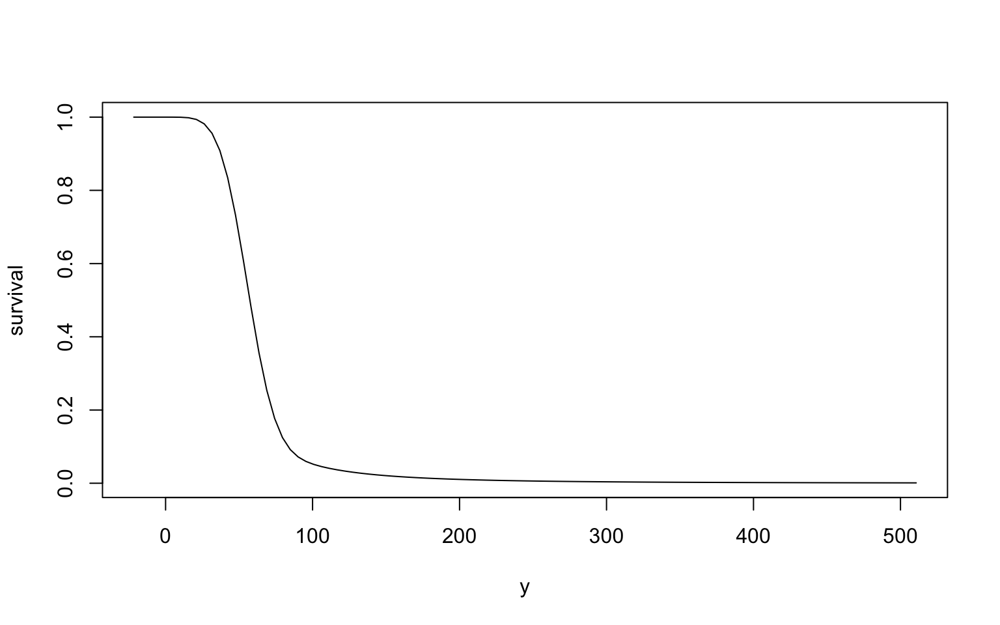
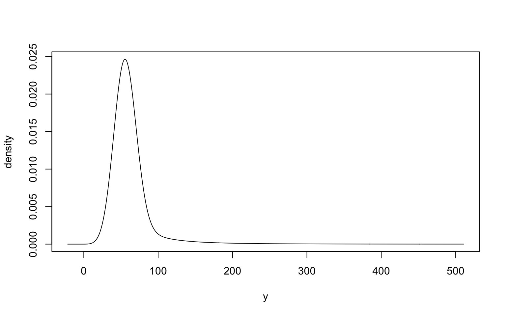
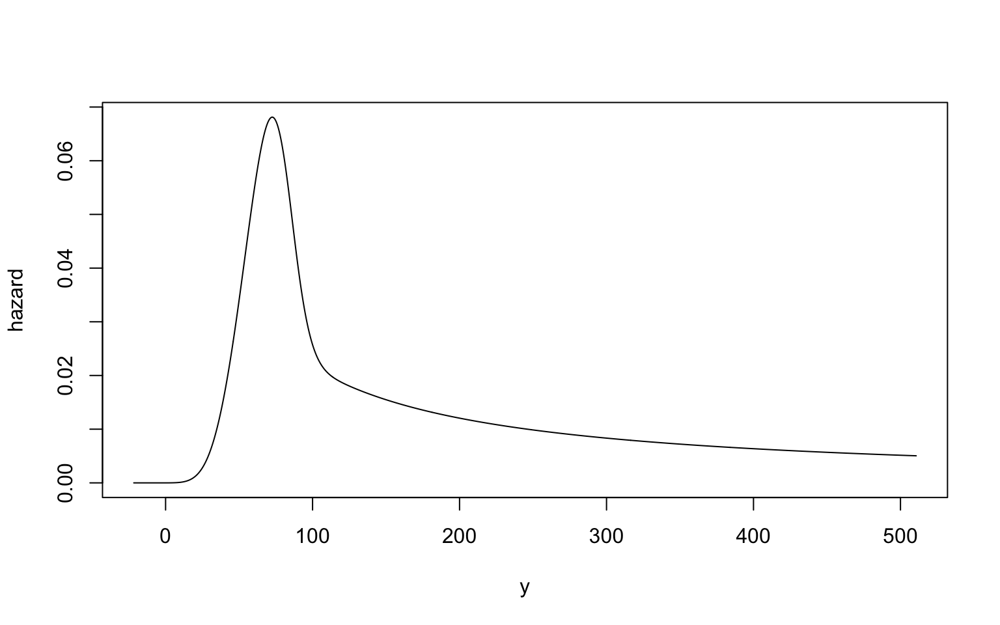

We picture distributions as one of the named forms --- Normal, Binomial, Poisson --- like choosing from a catalogue.
And when the catalogue doesn't fit, we hope someone somewhere has already built the one we need.

But the best distributions don't have names.

The one you need is the maximum of two others. Or a set of marginals bound together by a copula. Or whichever GEV sits closest to a table of quantiles somebody handed you. The list goes on.

Every one of those takes a sentence to describe. Each one is a project to build.

**This post is one claim: building the distribution you need should be as easy as describing it.**

Plenty of software solves some of this, but making the distribution you actually need is rarely easy. The probaverse is an attempt at a complete distribution workbench, so the space you can reach is as wide as the space you might reasonably need. If a tool or a family is missing, you can bring your own. And it works with the tidyverse.

It's young and the goals are ambitious. Help is needed.

## One field, as an example

Take flood frequency analysis, which is the field I know best. Substitute your own; the shape of the problem carries over.

Load probaverse and you'll see its component packages come along with it. It's on CRAN, and the whole suite is documented at [probaverse.com](https://probaverse.com).

``` r
library(probaverse)
```

    ── Attaching core probaverse packages ──────────────────────────────────────────
    ✔ distionary   0.2.0   Create and Evaluate Probability Distributions
    ✔ distplyr     0.3.0   Manipulate and Combine Probability Distributions
    ✔ famish       0.2.1   Flexibly Tune Families of Probability Distributions

The largest annual streamflow in the Coldwater River in British Columbia, Canada, is the bigger of a rainfall-generated flow and a snowmelt-generated flow.[^1] Here are 59 years of it, in $m^3/s$.

The data come from Water Survey of Canada station 08LG048. See [`coldwater_data.R`](coldwater_data.R) for the code that builds it; see [`coldwater.csv`](coldwater.csv) if you'd rather just have the file. Everything below runs off the table itself, so you don't need either one.

<details class="code-fold">
<summary>Show the data</summary>

``` r
df <- tibble::tribble(
    ~Year, ~Rainfall, ~Snowmelt, ~Max,
     2024,      19.6,      33.4, 33.4,
     2023,      23.3,      66.1, 66.1,
     2022,       5.1,      49.8, 49.8,
     2021,       260,      50.3,  260,
     2020,        39,      62.4, 62.4,
     2019,      9.46,      38.1, 38.1,
     2018,      30.7,      65.7, 65.7,
     2017,      92.7,      60.5, 92.7,
     2016,        31,      51.7, 51.7,
     2015,      31.7,      15.2, 31.7,
     2014,      40.9,      55.3, 55.3,
     2013,      17.1,      90.2, 90.2,
     2012,      26.4,      53.2, 53.2,
     2011,      15.9,      58.6, 58.6,
     2010,        11,      47.6, 47.6,
     2009,      17.8,      35.7, 35.7,
     2008,      14.6,      75.5, 75.5,
     2007,      65.8,      54.4, 65.8,
     2006,      83.7,      69.7, 83.7,
     2005,        36,      24.1,   36,
     2004,      48.8,      35.2, 48.8,
     2003,        69,      49.2,   69,
     2002,      39.4,      63.9, 63.9,
     2001,        17,      45.8, 45.8,
     2000,      9.22,      39.6, 39.6,
     1999,      53.9,      76.9, 76.9,
     1998,      8.79,        60,   60,
     1997,      22.2,      76.7, 76.7,
     1996,      35.3,      49.6, 49.6,
     1995,       104,        52,  104,
     1994,      12.5,      43.2, 43.2,
     1993,      6.54,      64.5, 64.5,
     1992,      23.2,      46.5, 46.5,
     1991,        32,      62.3, 62.3,
     1990,       101,      31.6,  101,
     1989,      53.9,      48.7, 53.9,
     1988,      20.7,      54.3, 54.3,
     1987,      11.7,      61.3, 61.3,
     1986,        30,      65.6, 65.6,
     1985,      10.8,      55.9, 55.9,
     1984,      96.2,        43, 96.2,
     1983,      12.8,      51.3, 51.3,
     1982,      8.31,      52.2, 52.2,
     1981,      17.8,      39.3, 39.3,
     1980,      92.6,      37.3, 92.6,
     1979,      39.5,      30.5, 39.5,
     1978,      31.1,      55.8, 55.8,
     1977,      17.6,      31.4, 31.4,
     1976,      19.7,      52.7, 52.7,
     1975,      40.5,      68.2, 68.2,
     1974,        21,      84.7, 84.7,
     1973,      4.13,      47.3, 47.3,
     1972,      26.1,      91.2, 91.2,
     1971,      23.4,      64.3, 64.3,
     1970,      4.39,      64.3, 64.3,
     1969,      7.19,      57.2, 57.2,
     1968,        34,      58.9, 58.9,
     1967,      57.5,      64.8, 64.8,
     1966,      17.2,      41.6, 41.6
)
```

</details>

``` r
df
```

    # A tibble: 59 × 4
        Year Rainfall Snowmelt   Max
       <dbl>    <dbl>    <dbl> <dbl>
     1  2024    19.6      33.4  33.4
     2  2023    23.3      66.1  66.1
     3  2022     5.1      49.8  49.8
     4  2021   260        50.3 260  
     5  2020    39        62.4  62.4
     6  2019     9.46     38.1  38.1
     7  2018    30.7      65.7  65.7
     8  2017    92.7      60.5  92.7
     9  2016    31        51.7  51.7
    10  2015    31.7      15.2  31.7
    # ℹ 49 more rows

Sure, you can fit a distribution directly to the maximum flows and call it a day. But you're giving up two things:

1.  in my experience, you get a better model when it's built from meaningful components, and
2.  components give you dials --- which is where this is heading.

So let's fit a distribution to each component. We won't dwell on optimizing the fit.

``` r
snowmelt <- fit_dst("norm", x = df$Snowmelt, method = "mle")
rainfall <- fit_dst("gev", x = df$Rainfall, method = "lmom")
```

``` r
snowmelt
```

    Normal distribution (continuous) 
    --Parameters--
        mean       sd 
    53.83559 15.20044 

``` r
rainfall
```

    Generalised Extreme Value distribution (continuous) 
    --Parameters--
     location     scale     shape 
    19.039914 15.143215  0.372321 

Now the maximum flow is the larger of a snowmelt draw and a rainfall draw.[^2]

``` r
maximum <- maximize(snowmelt, rainfall)
```

That result is still a distribution object --- it just doesn't have a name. It isn't a Normal or a GEV or anything else you could stick four letters in front of. It's a distribution in every sense that matters, and everything below treats it as one.

Retrieve the 50-, 100-, and 200-year flood quantiles:

``` r
enframe_return(
    maximum,
    at = c(50, 100, 200),
    arg_name = "return_period"
)
```

    # A tibble: 3 × 2
      return_period return
              <dbl>  <dbl>
    1            50   152.
    2           100   204.
    3           200   271.

And because the distribution is an object rather than a number, you can turn it over in your hands. Look at its survival function:

``` r
plot(maximum, "survival")
```



Its density:

``` r
plot(maximum, "density", n = 1001)
```



Its hazard function, if that's the idiom you think in:

``` r
plot(maximum, "hazard", n = 1001)
```



Some moments:

``` r
mean(maximum)
```

    [1] 62.77196

``` r
stdev(maximum)
```

    [1] 44.26569

Note what did *not* happen: nobody told `maximum` in advance which of these it would be asked for. Each one is a representation *of* the distribution, not the distribution itself. The distribution sits upstream of all of them.

### The dial

Now the components earn their keep.

Suppose that in some future year, snowmelt contributes 10% less and rainfall 10% more.

``` r
future <- maximize(0.9 * snowmelt, 1.1 * rainfall)
```

``` r
enframe_return(
    historical = maximum,
    future = future,
    at = c(50, 100, 200),
    arg_name = "return_period",
    fn_prefix = "flow"
)
```

    # A tibble: 3 × 3
      return_period flow_historical flow_future
              <dbl>           <dbl>       <dbl>
    1            50            152.        167.
    2           100            204.        224.
    3           200            271.        298.

One call, and the scenarios sit next to each other. Ask a different what-if and it's one more line. That is what building rather than selecting buys you: the model is a thing you can perturb, not a pipeline you re-run.

## "Couldn't you just simulate?"

Yes, sometimes you can get by just simulating.

``` r
sims <- pmax(
    rnorm(1e6, mean_sm, sd_sm),
    rgev(1e6, loc, scale, shape)
)
quantile(sims, probs = 1 - 1 / c(50, 100, 200))
```

In doing so, you're back to bespoke coding, but with Monte Carlo noise.

The noise is worst in the tail, which is exactly where the decision lives, and the code only gets harder as the model grows.

And some things it can't do at all. Estimation needs a space of distributions to search over, and draws only come from parameters you've already picked. Conditioning is no better: to slice a multivariate distribution you keep the draws near the value you're conditioning on and throw the rest away. Add dimensions and there's almost nothing left.

Simulation has its place. It just doesn't hand you back a distribution.

## It plays well with data frames

Distributions being objects means they can live in a column --- which makes the scenario analysis above generalize for free.

``` r
library(tidyverse)
```

The dial above turned once. Put a few settings of it in a tibble instead --- the first row is the historical case, and each one after it dials snowmelt further down and rainfall further up.

``` r
scenarios <- tibble(
    snowmelt_scale = c(1, 0.95, 0.90, 0.85),
    rainfall_scale = c(1, 1.05, 1.10, 1.15)
)
scenarios
```

    # A tibble: 4 × 2
      snowmelt_scale rainfall_scale
               <dbl>          <dbl>
    1           1              1   
    2           0.95           1.05
    3           0.9            1.1 
    4           0.85           1.15

Now give each row its maximum-flow distribution.[^3]

``` r
scenarios <- mutate(
    scenarios,
    maximum = map2(
        snowmelt_scale, rainfall_scale,
        \(s, r) maximize(s * snowmelt, r * rainfall)
    )
)
scenarios
```

    # A tibble: 4 × 3
      snowmelt_scale rainfall_scale maximum  
               <dbl>          <dbl> <list>   
    1           1              1    <maximum>
    2           0.95           1.05 <maximum>
    3           0.9            1.1  <maximum>
    4           0.85           1.15 <maximum>

A column of distributions, one per scenario. Evaluate return periods down that column and unnest:

``` r
scenarios |>
    mutate(
        data = map(
            maximum,
            enframe_return,
            at = c(50, 100, 200),
            arg_name = "return_period"
        ),
        .keep = "unused"
    ) |>
    unnest(data)
```

    # A tibble: 12 × 4
       snowmelt_scale rainfall_scale return_period return
                <dbl>          <dbl>         <dbl>  <dbl>
     1           1              1               50   152.
     2           1              1              100   204.
     3           1              1              200   271.
     4           0.95           1.05            50   160.
     5           0.95           1.05           100   214.
     6           0.95           1.05           200   284.
     7           0.9            1.1             50   167.
     8           0.9            1.1            100   224.
     9           0.9            1.1            200   298.
    10           0.85           1.15            50   175.
    11           0.85           1.15           100   234.
    12           0.85           1.15           200   311.

A four-scenario sensitivity analysis, in a tibble, with no loop and no bookkeeping. The [tidyverse](https://www.tidyverse.org/) made the rectangle a first-class object and defined verbs on it, and that single move reorganized a decade of applied data work. Distributions have never had their equivalent.

The debt is deliberate, and it doesn't stop at the name. A suite of small packages that share conventions, verbs that hand back the same kind of thing they were handed, and the bet that getting the object right is what makes everything downstream easy: probaverse is that wager placed on a different object.[^4]

## Principles

Not all of these are settled. Here's where they stand.

**A distribution is defined by its representations, and they form a network.** Anchor it with one --- a CDF, a density, a quantile function --- and every other property follows. Specify more and probaverse leans less on numerical algorithms, so you get more accuracy. Today the CDF is still the anchor; anchoring from any node is designed but not built.

**Supports are objects.** A support says where probability lives, and in what form --- density or mass. probaverse asks you to declare it when you define a distribution, and that declaration is what buys numerical precision later.

**A family is a collection of distributions indexed by parameters.** That's the plan, at least. A family will be a distribution with parameters left unresolved, so it needs no class of its own, and a parameter won't have to be a real number. Estimation is then the reduction of that parameter space, in stages if you like: restrict to mean zero now, narrow the rest against the residuals later. Hence `famish` rather than `estimate`.

**Human readability comes first.** Code is read far more than it's written, especially in the age of agentic AI, and a distributional model nobody can follow isn't much of a model.

**Open, and open to people.** MIT, developed in public.

## What already exists

I'm not the first person to want this, and between them the existing tools have solved a lot. They all agree on the starting point: a distribution should be a value you can pass around.

`distributional` lets you keep a column of named distributions and evaluate them all at once; it started at about the same time as probaverse, independently of each other. `distr` adds, multiplies and takes maxima of distributions. `scipy.stats` gives you a distribution object once you fix its parameters. And for dependence, R has `copula`, `VineCopula` and `rvinecopulib`, while Julia's [`Copulas.jl`](https://github.com/lrnv/Copulas.jl) goes further still: give it a copula and a set of marginals, and it hands back a joint distribution you can use like any other.

What none of them let you do easily is build a distribution they didn't plan for. Each ships a list of things you can make --- a mixture, a truncation, a transformation, a sum --- and every item on that list was written out by hand. If what you want isn't on the list, you write it yourself.

How much you write varies. `distributional` won't fill in a function you didn't supply: give it a density and a CDF but no quantile function, and asking for a quantile is an error rather than a calculation. `distr` will --- it reconstructs the rest from any one of the density, CDF, quantile function or sampler, and it has done that since 2006. What `distr` doesn't have is a hazard function, or a GEV, or any way to hold a column of distributions, and a new family there means writing an S4 class and its methods.

So the maximum of a GEV and a Normal is out of reach in both, for opposite reasons. `distributional` has the GEV but won't take a maximum. `distr` will take a maximum but has no GEV, and adding one means writing the class before you get to the modelling.

The same gap shows up a layer up. `Copulas.jl` will take any marginal you give it --- but Julia has no way to build that maximum either, so you have nothing to give it. The copula layer is waiting on a distribution that the layer below it can't produce.

None of this is a shortage of good ideas. `distr` worked this out long before I did, and is still the most capable thing in R for it. What hasn't happened is someone making it cheap: one object that fills in what you didn't supply, composes without ceremony, and sits in a data frame beside everything else you're working with. That's what probaverse is for --- the distributions with no name, which is most of the useful ones.

## What's missing

The vision is much larger than the code. Here's the honest state of it.

**Univariate** has a strong foothold. It still needs speed, and distributions that take less memory to store.

**Families.** Sometimes you want to name your own parameters --- adding a scale to a *t* distribution, say, or forcing the marginals in a D-vine to share theirs.

**Estimation** needs to open up, along with goodness metrics. `fit_dst()` covers family, data and method; missing are your own criteria, narrowing that stops partway, and fitting to a target that isn't data, like the member of a family closest to a table of quantiles.

**Composition** needs depth. Survival-type models where the tail is unknown, and hierarchical modelling, where one distribution's parameter is itself a distribution.

**Multivariate.** Designed and unbuilt, as is `couple`, the dependence layer that goes with it.

## The invitation

I'm Vincenzo Coia. I build probaverse, and the reason the example is a river is that hydrology is where I first got tired of not being able to snap distributions together like Lego blocks.

It's time to move probaverse away from single-maintainer governance, and that isn't something I can do by myself. Which is why this post exists.

Three ways in.

**Build something.** Send a pull request. I'd love a simpler way to handle the map-enframe-unnest workflow above, for one. If it's more than small, ask first --- I may already be partway into a design.

**Use it and tell me what's awkward.** Where did it pinch? What was unclear? Those reports are as useful to me as bug reports.

**Push on the design.** The principles above aren't all settled, and the settled ones took argument to get there. If something looks wrong, say so.

The packages live at [probaverse.com](https://probaverse.com). Email **vincenzo.coia@gmail.com**, or open a GitHub issue --- either is fine. I read everything and I reply to everything.

The distribution you need probably doesn't have a name. It should still be something you can pick up, turn over, and build with.

[^1]: I'm simplifying to keep the focus on modelling capabilities.

[^2]: Assuming independence.

[^3]: Distributions aren't vectorized yet, so we reach for `purrr`. Vectorizing wouldn't finish the job anyway: with a vector of distributions and a vector of evaluation points, something still has to say whether you want them paired off or crossed, and what shape the answer comes back in. A single verb doing the `map()`, the `enframe_*()` and the `unnest()` at once is on my list.

[^4]: For the curious: defining and evaluating distributions is `distionary`, manipulating them is `distplyr`, and fitting them to data is `famish`. `probaverse` loads all three.
