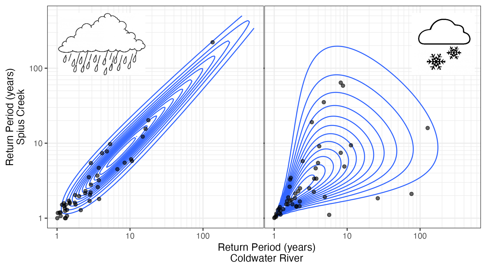

The Coldwater River and Spius Creek are two tributaries of the Nicola River in British Columbia, Canada, an area identified by the provincial government for floodplain mapping. My role in this project was to identify the 200-year floodplain hazard map, and that involved overcoming two main statistical challenges.

The first challenge was that it's unrealistic to model a 200-year flood occurring in both tributaries at the same time because they are unlikely to flood to the same extent simultaneously. The solution here was to model a 200-year flood in the Coldwater River, and calculate a realistic corresponding flow (such as the median or mode) in Spius Creek from its conditional distribution -- and vice versa. 

The second challenge was that floods in both watersheds are the result of two very different patterns: flooding due to snowmelt in the spring, or rainfall in the fall/winter. In other words, they have a mixed regime. To capture these distinct behaviours, I built a copula-based dependence model for each type of peak, and combined them to obtain the conditional distribution of corresponding flows that we were after.

The figure below is one way to visualize the copulas fit to each process, as a joint distribution between flows expressed in terms of return period. The isolines represent the probability density function.

