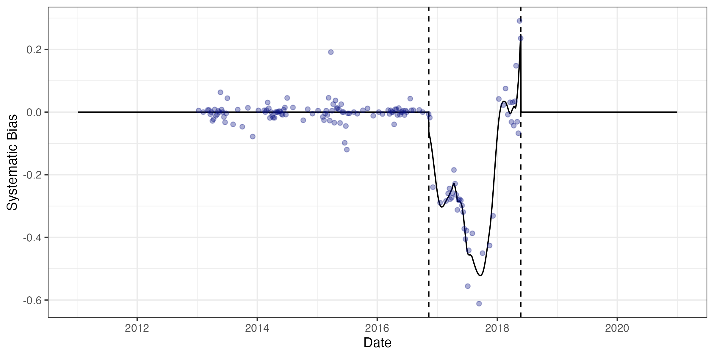
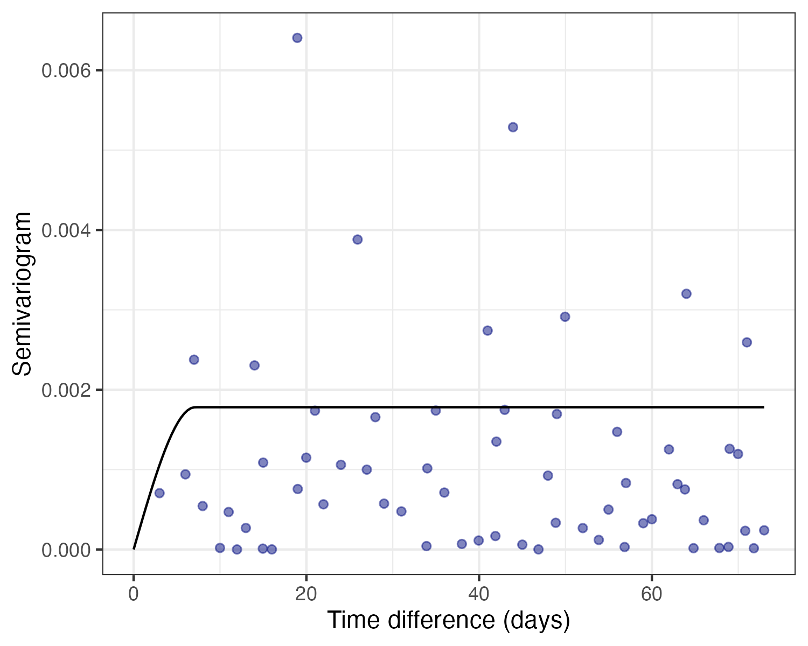

Erickson Creek is a small watercourse in the Elk Valley in British Columbia, Canada. To measure the creek's discharge, a level logger was installed to collect data frequently and automatically, alongside the occasional manual measurement. The goal of this analysis was to use the manual measurements whenever available, and to fill in the gaps by stringing the level logger measurements through the manual measurements. In other words, a manual measurement should have a say as to what the discharge was both soon after and before the measurement was taken.
The featured photo shows the result for 2017 in blue, with the points representing the manual measurements, and the upper black line representing the level logger measurements.

The first step was to adjust for the obvious bias occurring in 2017, as shown in the figure below. A period of bias was assumed (dashed lines), and a LOESS regression fit to the difference between the two measurement types (solid line). Unbiased level logger measurements can be obtained after adjusting for this bias.

<!-- The second step was to ensure that the level logger measurements "string through" the manual measurements. In other words, a manual measurement should have a say in inferring the discharge estimated both soon after and before. -->
To string the level logger through the manual measurements, one-dimensional kriging was used to estimate the bias-adjusted level logger error. The semi-variogram is a key component of the kriging model, and shows how long before the level logger "loses its memory" of past recordings. In this case, there is no obvious increasing trend in memory loss, but that just means that manual measurements were not taken close enough to detect any memory. Forcing the level logger to have perfect memory moment-to-moment (i.e., a zero nugget), the following figure shows the best fitting semi-variogram (black curve), showing a roughly 7-day period before the level logger loses memory of its past recordings.

