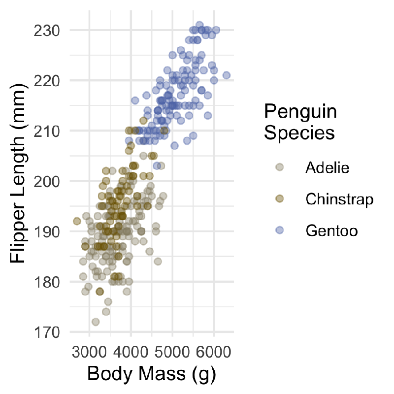

```{r, message = FALSE, warning = FALSE, echo = FALSE}
library(palmerpenguins)
library(tidyverse)
library(gapminder)
lotr <- "https://raw.githubusercontent.com/jennybc/lotr-tidy/master/data/lotr_tidy.csv" %>%
  read_csv()
#knitr::opts_chunk$set(echo = FALSE, fig.height = 4, warning = FALSE, dpi = 1500, message = FALSE)
knitr::opts_chunk$set(echo = FALSE, warning = FALSE, message = FALSE, dpi = 76 * 2, fig.height = 4)
theme_set(theme_minimal())
```


class: middle, center

# Pictures are worth 1000 words

[Challenger space shuttle example](https://speakerdeck.com/jennybc/ggplot2-tutorial?slide=7)

Just plot the data!

---

## Outline for Today

### Part 1

Visualizing different types of data

### Part 2

Principles for making effective plots

### Attribution

Ideas are from ["Fundamentals of Data Visualization"](https://clauswilke.com/dataviz/) by Claus Wilke. You should check it out!

Slides are my own.

---
class: inverse, middle, center

# Part 1

# Choosing an effective plot for your data type

---
class: middle, center

# [data-to-viz](https://www.data-to-viz.com/)


---

## Visualizing Amounts

Use bars.

```{r}
(plotr <- lotr %>% 
  count(Film, wt = Words) %>% 
  ggplot(aes(Film, n)) +
  geom_col() +
  labs(x = "", y = "", title = "Words Spoken in Lord of the Rings"))
```

---

## Visualizing Amounts

Use bars. Sensibly rearrange.

```{r}
(plotr <- plotr + 
  aes(x = fct_reorder(Film, n, .desc = TRUE)) +
  xlab(""))
```
In this case: movie order __and__ descending order.


---


## Visualizing Amounts

Bars must go to zero because we interpret their _area_. __Don't do this__:

```{r}
lotr %>% 
  count(Film, wt = Words) %>% 
  mutate(n = n - 5000) %>% 
  ggplot(aes(fct_reorder(Film, n, .desc = TRUE), n)) +
  geom_col() +
  theme_minimal() +
  labs(x = "", y = "", title = "Words Spoken in Lord of the Rings") +
  scale_y_continuous(breaks = (0:3) * 1000, labels = (0:3) * 1000 + 5000)
```

---

## Visualizing Amounts

When emphasizing _differences_ instead of _ratios_, zero doesn't matter. 

Use points instead of bars:

```{r}
pgdp <- gapminder %>% 
  filter(continent == "Europe",
         year == 2007) %>% 
  ggplot(aes(country, gdpPercap)) +
  geom_point() +
  scale_y_continuous("GDP Per Capita", labels = scales::dollar_format()) +
  xlab("")
pgdp + theme(axis.text.x = element_text(angle = 90))
```

---

## Visualizing Amounts

x-labels too big? Don't be afraid to swap axes.

```{r}
pgdp + 
  coord_flip()
```

---

## Visualizing Amounts

Sorting, again.

```{r}
pgdp + 
  coord_flip() +
  aes(x = fct_reorder(country, gdpPercap)) +
  xlab("")
```

---

## Visualizing Distributions

Want to compare body mass of three penguin species? Please don't use pinhead plots.

```{r}
penguins %>% 
  remove_missing() %>% 
  group_by(species) %>% 
  summarise(mass_mu = mean(body_mass_g),
            mass_sd = sd(body_mass_g)) %>% 
  ggplot(aes(species)) +
  geom_errorbar(aes(ymax = mass_mu + mass_sd,
                    ymin = mass_mu - mass_sd),
                width = 0.25) +
  geom_col(aes(y = mass_mu)) +
  xlab("") +
  ylab("Body Mass (g)") +
  ggtitle("Penguin Size")
```

---

## Visualizing Distributions

Plot all the data instead.

```{r}
penguins %>% 
  ggplot(aes(species, body_mass_g)) +
  geom_point() +
  labs(x = "", y = "Body Mass (g)", title = "Penguin Size")
```

---

## Visualizing Distributions

Even better, add some jitter and alpha transparency:

```{r}
penguins %>% 
  ggplot(aes(species, body_mass_g)) +
  geom_jitter(width = 0.1, alpha = 1/3) +
  labs(x = "", y = "Body Mass (g)", title = "Penguin Size") +
  scale_y_continuous(breaks = seq(3000, 6000, by = 1000))
```


---

## Visualizing Distributions: too much data to show

Too much data to show? Could use boxplots:

```{r}
penguins %>% 
  ggplot(aes(species, body_mass_g)) +
  geom_boxplot(width = 0.2, fill = "gray") +
  labs(x = "", y = "Body Mass (g)", title = "Penguin Size")
```

---

## Visualizing Distributions: too much data to show

Could also make a histogram for each one.

```{r}
penguins %>% 
  ggplot(aes(body_mass_g)) +
  facet_wrap(~ species) +
  geom_histogram() +
  labs(x = "Body Mass (g)", title = "Penguin Size") +
  scale_x_continuous(breaks = seq(3000, 6000, by = 1000))
```


---

## Visualizing Distributions: too much data to show

Whatever you do, don't combine and colour:

```{r}
penguins %>% 
  ggplot(aes(body_mass_g, fill = species)) +
  geom_histogram() +
  labs(x = "Body Mass (g)", title = "Penguin Size") +
  scale_x_continuous(breaks = seq(3000, 6000, by = 1000))
```

---

## Visualizing Distributions: too much data to show

Better is to use density plots:

```{r}
penguins %>% 
  ggplot(aes(body_mass_g, fill = species)) +
  geom_density(alpha = 1 / 2) +
  labs(x = "Body Mass (g)", title = "Penguin Size") +
  scale_x_continuous(breaks = seq(3000, 6000, by = 1000))
```


---

## Visualizing Distributions: too much data to show

Even better is to use ridge plots:

```{r}
penguins %>% 
  ggplot(aes(body_mass_g, species)) +
  ggridges::geom_density_ridges(alpha = 0.5) +
  labs(x = "Body Mass (g)", y = "")
```

Who care's about the density values, anyway?

---

## Visualizing Distributions: too much data to show

Can pack in many categories (ordered, of course).

```{r}
gapminder %>% 
  ggplot(aes(gdpPercap, factor(year))) +
  ggridges::geom_density_ridges(alpha = 0.5) +
  scale_x_log10("Global GDP Per Capita", labels = scales::dollar_format()) +
  ylab("Year")
```

---

## Visualizing Distributions: too much data to show

You might even be able to get away with colouring by continent. (arguable)

```{r}
gapminder %>% 
  ggplot(aes(gdpPercap, factor(year))) +
  ggridges::geom_density_ridges(aes(fill = continent), alpha = 0.5) +
  scale_x_log10("Global GDP Per Capita", labels = scales::dollar_format()) +
  ylab("Year") +
  scale_fill_discrete("")
```

---

## Visualizing Trends

Stacking just doesn't work.

```{r}
ptrend <- gapminder %>% 
  mutate(gdp = gdpPercap * pop) %>% 
  group_by(year, continent) %>% 
  summarise(gdpPercap = sum(gdp) / sum(pop)) %>% 
  ggplot(aes(year, gdpPercap)) +
  scale_y_continuous("GDP Per Capita", labels = scales::dollar_format())
ptrend + geom_col(aes(fill = continent))
```


---

## Visualizing Trends

Putting bars beside each other is better, but still not good.

```{r}
ptrend + geom_col(aes(fill = continent), position = "dodge")
```

---

## Visualizing Trends

Best is to forego the bars and use lines:

```{r}
ptrend + geom_line(aes(colour = continent))
```

---

## Visualizing Trends

Bonus: line up the legend.

```{r}
ptrend + 
  geom_line(aes(colour = fct_reorder2(continent, year, gdpPercap))) +
  scale_colour_discrete("continent")
```

---

# Activity: Worsen the plot

```{r}
ggplot(airquality, aes(Month, Temp, group = Month)) +
  geom_boxplot(outlier.shape = NA) +
  geom_jitter(alpha = 0.3, width = 0.2) +
  labs(x = "", y = "Daily High Temperature (°F)") +
  scale_x_continuous(breaks = c(5, 6, 7, 8, 9), 
                     labels = c("May", "June", "July", "August", "September"))
```

Code and idea by Firas Moosvi


---
class: inverse, middle, center

# Part 2

# Principles of Figure Design

---
class: middle, center

# Data-to-ink ratio

[Less is More](https://speakerdeck.com/cherdarchuk/remove-to-improve-the-data-ink-ratio)


---

## Overlapping Points

How do you know there aren't overlapping points here? You don't.

```{r}
ggplot(penguins, aes(body_mass_g, flipper_length_mm)) +
  geom_point() +
  theme_minimal() +
  labs(x = "Body Mass (g)", y = "Flipper Length (mm)")
```

---

## Overlapping Points

Add some transparency, and suddenly you can tell.

```{r}
ggplot(penguins, aes(body_mass_g, flipper_length_mm)) +
  geom_point(alpha = 1 / 3) +
  theme_minimal() +
  labs(x = "Body Mass (g)", y = "Flipper Length (mm)")
```

---

## Overlapping Points

Or, jitter the points a little bit.

```{r}
ggplot(penguins, aes(body_mass_g, flipper_length_mm)) +
  geom_jitter() +
  theme_minimal() +
  labs(x = "Body Mass (g)", y = "Flipper Length (mm)")
```

---

## Overlapping Points

When jittering isn't an option, and alpha transparency isn't enough?

```{r}
ggplot(diamonds, aes(carat, price)) +
  geom_point(alpha = 0.1) +
  theme_minimal() +
  labs(x = "Diamond Carat", y = "Price")
```

---

## Overlapping Points

Consider reducing the size of the points:

```{r}
ggplot(diamonds, aes(carat, price)) +
  geom_point(alpha = 0.1, size = 0.1) +
  theme_minimal() +
  labs(x = "Diamond Carat", y = "Price")
```

---

## Overlapping Points

Or, use hexagonal binning (heatmap):

```{r}
ggplot(diamonds, aes(carat, price)) +
  geom_hex(bins = 100) +
  theme_minimal() +
  labs(x = "Diamond Carat", y = "Price") +
  scale_fill_distiller(trans = "log", palette = "Reds", breaks = c(1, 10, 100, 1000), direction = 1)
```


---

## Colour

Don't try to choose your own colours. 

```{r}
p <- ggplot(penguins, aes(body_mass_g, flipper_length_mm, colour = species)) +
  geom_point(alpha = 2 / 5) +
  theme_minimal() +
  labs(x = "Body Mass (g)", y = "Flipper Length (mm)")
p + scale_colour_manual("Penguin\nSpecies", values = c("yellow", "blue", "red"))
```

---

## Colour

Leave it to an expert: https://colorbrewer2.org/

```{r}
p + scale_colour_brewer("Penguin\nSpecies", palette = "Dark2") 
```

---

## Colour

Avoid too many colours

```{r}
gapminder %>% 
  filter(continent == "Africa") %>% 
  ggplot(aes(gdpPercap, lifeExp, colour = country)) +
  geom_point(alpha = 0.2) +
  scale_x_log10() +
  theme_minimal() +
  labs(x = "GDP per capita",
       y = "Life Expectancy",
       title = "African Countries")
```

---

## Colour

Are you sure you just don't want to highlight a few or even one category of interest?

```{r}
gapminder %>% 
  filter(continent == "Africa") %>% 
  mutate(m = if_else(country == "Madagascar", "Madagascar", "Other")) %>% 
  ggplot(aes(gdpPercap, lifeExp, 
             colour = m,
             alpha = m,
             size = m)) +
  geom_point() +
  scale_x_log10() +
  theme_minimal() +
  labs(x = "GDP per capita",
       y = "Life Expectancy",
       title = "African Countries") +
  scale_colour_manual("", values = c("#d95f02", "black")) +
  scale_alpha_manual("", values = c(1, 0.2)) +
  scale_size_manual("", values = c(2, 0.8))
```

---

## Colour Blindness

Previous colour palette with Protanope (reduction of reds):




<!-- { width=50% } -->
<!-- { width=50% } -->

(Converted by [hclwizard](http://hclwizard.org/cvdemulator/))

---

## Colour Blindness

You could try to accommodate colour blindness **and** still use colour...

```{r}
p + scale_colour_viridis_d("Penguin\nSpecies")
```

Viridis scale

---

## Colour Blindness

Better yet, don't rely on colour at all. Facet by species:

```{r}
ggplot(penguins, aes(body_mass_g, flipper_length_mm)) +
  facet_wrap(~ species) +
  geom_point(alpha = 2 / 5) +
  theme_minimal() +
  labs(x = "Body Mass (g)", y = "Flipper Length (mm)")
```

Notice the axes are comparable.

---

## Choose an Appropriate Scale

Here, the data are pressed against the y-axis. Tons of whitespace.

```{r}
(plog <- ggplot(gapminder, aes(gdpPercap, lifeExp)) +
  geom_point(alpha = 0.25) +
  labs(x = "GDP Per Capita", y = "Life Expectancy") +
  scale_x_continuous(labels = scales::dollar_format()))
```

---

## Choose an Appropriate Scale

Use a log scale on the x-axis.

```{r}
plog + scale_x_log10(labels = scales::dollar_format())
```

---

## Activity: Improve the Plot

How can we make this plot better?

```{r}
ggplot(gapminder, aes(gdpPercap, lifeExp)) +
  geom_point(aes(colour = continent, size = pop)) +
  theme_dark() +
  theme(axis.title.x = element_text(size = 4))
```

---
class: inverse, middle, center

# Activity: Reflection

Reflect in groups:

1. What one thing will you do differently from today's lecture?
2. What's your favourite plot from this lecture?


---

## Final Remarks: Making plots

- All plots today are __reproducible__. 
- Built with `ggplot2` in R.
- Take a look at Episode 5 of [STAT 545](https://www.youtube.com/channel/UCrB-uourf2vxGeBnGjQrA0w) for an intro to `ggplot2`
- Non-reproducible (like Excel) not recommended, but will do if that's all you know.

```{r, out.width = '50%'}
knitr::include_graphics('ggplot2.png')
```

